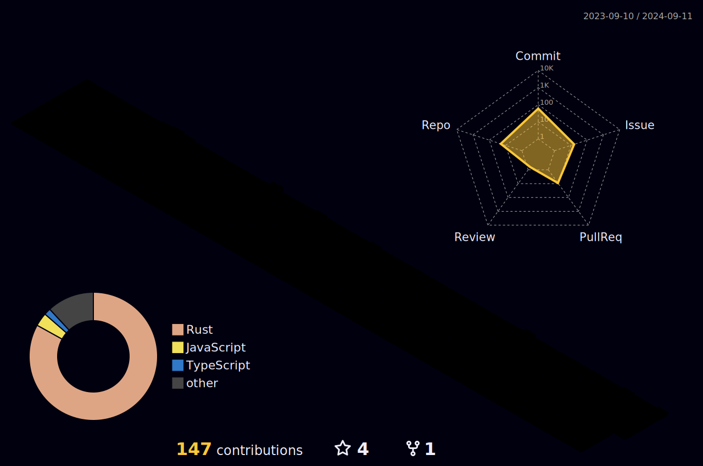

<h1 align="center">Welcome</h1>

A passionate developer loves writing Rust and focus on writing high performance, scalable and secure applications, fan of low level programming, and loves concurrent programming. 

---

 
 

<h3 align="center"> Technologies </h2>

 
<ul >
<li> 🦀 Rust + 🐧 Linux + Go + CPP</li>
<li> Low-Level & System Programming</li>
<li> Backend Programming</li>
<li> Protocol development</li>
</ul>

<ul>
<li> Databases</li>
<li> Blockchain</li>
<li> Network application</li>
<li> WASM</li>
</ul>

---

---

<h3 align="center">Connect with me:</h3>

